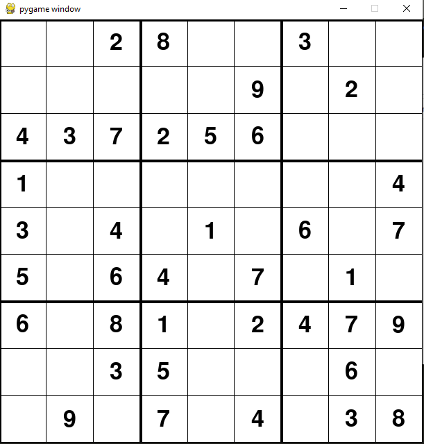
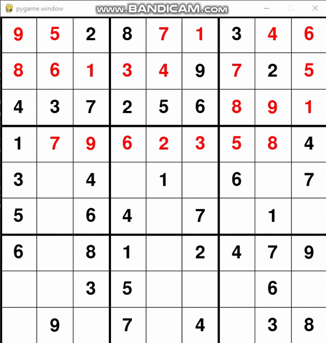
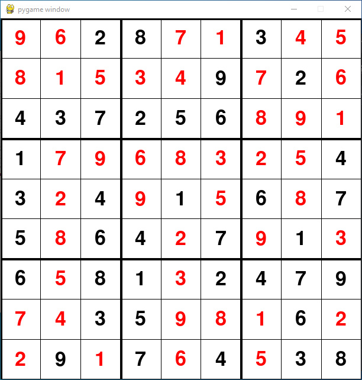

# Sudoku_Solver (Backtracking Visualization) using python, pygame
Backtracking is a general algorithm for finding all (or some) solutions to some computational problems, notably constraint satisfaction problems, that incrementally builds candidates to the solutions, and abandons a candidate ("backtracks") as soon as it determines that the candidate cannot possibly be completed to a valid solution.

<h2>Unsolved Sudoku</h2>

<h2>Backtracking Demo</h2>

<h2>Solved Sudoku</h2>

